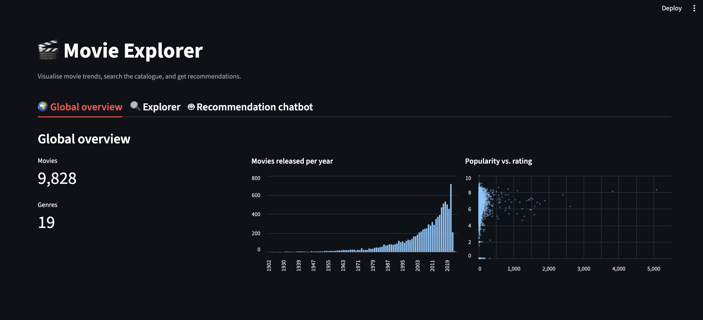
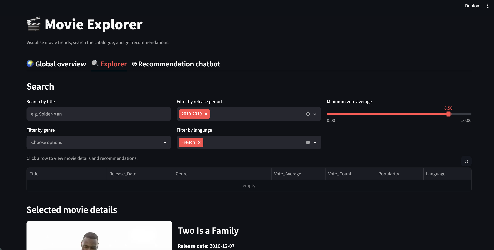
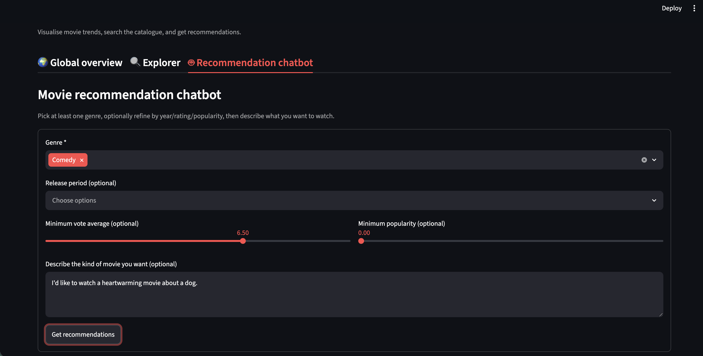

# Movie Explorer

An interactive movie data visualisation and explorer application. 
An optional recommendation chatbot is powered by **RAG** (Retrieval-Augmented Generation) and a local **Hugging Face** open-source LLM.

## Plateform

<p align="center">
  
  
  
</p>

<p align="center">
  <strong>Global overview</strong> &nbsp;·&nbsp; <strong>Explorer</strong> &nbsp;·&nbsp; <strong>Recommendation chatbot</strong>
</p>

## Installation

### Requirements

- **Python** 3.11+ ([pyenv](https://github.com/pyenv/pyenv) users: `.python-version` is included)
- **Internet** on first run (downloads open models from Hugging Face Hub — no API token required, the model will be download automatically on the first chat request.)


### Quick start (recommended)

From the repo root:

```bash
git clone <your-repo-url>
cd hiParis-challenge/movie-explorer

python3 scripts/setup.py
source .venv/bin/activate      # macOS / Linux
# .venv\Scripts\activate       # Windows

streamlit run app.py
```

`scripts/setup.py` creates `.venv`, installs pinned dependencies, and builds `movies_clean.csv` from `../movies.csv`. The app also re-runs preprocessing automatically if the raw file is newer than the clean file.

### Manual setup (alternative)

```bash
cd movie-explorer
python3.11 -m venv .venv
source .venv/bin/activate
pip install --upgrade pip
pip install -r requirements.txt
streamlit run app.py
```

First run downloads the embedding model (`all-MiniLM-L6-v2`, ~90 MB) and may take 30–60 s while the search index is built.

The chatbot LLM (`SmolLM2-360M-Instruct`, ~360 MB) downloads automatically on the first chat request. 

## Configuration

Edit **`config.yaml`** to change paths and model settings without modifying code:
Restart Streamlit after changing the config.


```yaml
data:
  raw_movies_csv: ../movies.csv
  movies_csv: ../movies_clean.csv   # relative to movie-explorer/ or absolute; built by utils/preprocess.py

llm:
  model: HuggingFaceTB/SmolLM2-360M-Instruct   # default ungated model; some Hub models require license acceptance and `huggingface-cli login`
  max_new_tokens: 512   # maximum length of the generated chat response (output tokens)
  temperature: 0.1      # sampling randomness (0 = more deterministic, higher = more varied; typical range 0–1)

rag:
  embedding_model: all-MiniLM-L6-v2   # sentence-transformers model used for semantic search
  batch_size: 64                      # number of movie texts embedded at once when building the index (32 or 64 is common)

recommendations:
  top_n: 5                 # number of movies returned to the user
  rag_top_k_multiplier: 4  # RAG shortlist size = top_n × this value
  rag_top_k_min: 20        # minimum number of RAG candidates before ranking

logging:
  directory: logs          # log files written here (app.log, errors.log, debug.log)
```

## Run the app

```bash
streamlit run app.py
```

Open the URL shown in the terminal (usually `http://localhost:8501`).

**Tabs:**
- **Global overview** — dataset charts
- **Explorer** — search, filters, movie details, similar movies
- **Recommendation chatbot** — genre-based AI recommendations

## Logging

Logs are written to `movie-explorer/logs/`:

| File         | Content                          |
|--------------|----------------------------------|
| `app.log`    | General INFO events              |
| `errors.log` | Errors with stack traces         |
| `debug.log`  | Detailed debug output            |

```bash
tail -f logs/errors.log
```

## Tech stack

| Component        | Library / tool              |
|------------------|-----------------------------|
| UI               | Streamlit, Altair           |
| Data             | pandas                      |
| Similar movies   | scikit-learn (TF-IDF)       |
| RAG embeddings   | sentence-transformers       |
| LLM              | Hugging Face Transformers (SmolLM2) |
| Config           | PyYAML                      |

## Troubleshooting

| Issue | Fix |
|-------|-----|
| `ModuleNotFoundError` | Run `python3 scripts/setup.py` or activate `.venv` and `pip install -r requirements.txt` |
| Missing data file | Put `movies.csv` in the parent folder, or edit `config.yaml` |
| Slow first chat | LLM model downloads once (~360 MB); CPU inference can take 10–30 s |
| LLM fallback only | Check network, disk space, and `logs/errors.log`; try another open model in `config.yaml` |
| Missing columns error | Run `python -m utils.preprocess` and clear Streamlit cache (In the running app, open the menu (⋮ top-right) → Clear cache → Reload the page) |
| Slow first launch | Embedding index is built once and cached (~30–60 s for ~10k movies) |
| Verify install | After setup: `python -c "from app import get_data_version, load_data; print(len(load_data(get_data_version())), 'movies')"` |

